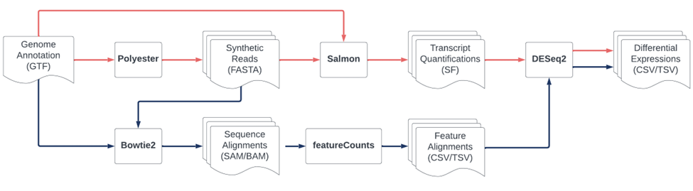

# IFN646BioMed-Project: Reproducibility and Robustness of Genomics Results

This project focuses on the reproducibility and robustness of genomics results. Our aim is to understand the consistency and reliability of genomic analyses across different conditions and methodologies.

[Detailed Project Description](https://canvas.qut.edu.au/courses/14810/pages/project-3-reproducibility-and-robustness-of-genomics-results?module_item_id=1451521)

## Data Source

For this project, the data generation is under your purview. We've set the context in terms of the genome to work with.

**Recommended Genome**: *Drosophila melanogaster* (Fruit Fly)
- Widely recognized as an experimental model organism.
- Manageable genome size ensuring scalability.
- [Access the Data](https://www.ncbi.nlm.nih.gov/datasets/genome/GCF_000001635.27/): Download genome sequences (FASTA), annotations (GTF), and transcripts (FASTA). The zip file is approximately 68MB.

**Alternative Genome**: *Mus musculus* (Mouse)
- A more extensive genome for those seeking a challenge.
- [Access the Data](https://www.ncbi.nlm.nih.gov/datasets/genome/GCF_000001635.27/): Follow the same steps as above. The zip file is roughly 975MB.

## Project Tasks

1. **Data Generation**: Use tools like [polyester](https://bioconductor.org/packages/release/bioc/html/polyester.html) to generate sets of reads for your chosen genome. Simulate multiple experiments for identical conditions.

2. **Introducing Noise**: Examine the impact of shuffling reads. For example, compare results from sequences A-B-C-D vs. D-B-A-C. Consider introducing sequencing errors in some reads.

3. **Analysis Methods**:
   - **Method 1**: 
     - Align to the reference genome using Bowtie2.
     - Quantify at the gene level with featureCounts.
     - Conduct differential expression analysis with DESeq2.
   - **Method 2**: 
     - Perform quantification using pseudoalignment with [Salmon](https://combine-lab.github.io/salmon/).
     - Follow up with differential expression analysis using DESeq2.

4. **Evaluation**: Assess the consistency in results.
   - Compare results within the same method for different input variations.
   - Contrast results for identical inputs across different methods.

## Key Questions

- How consistent are the results within the same method for different input variations?
- How consistent are the results for identical inputs across different methods?

